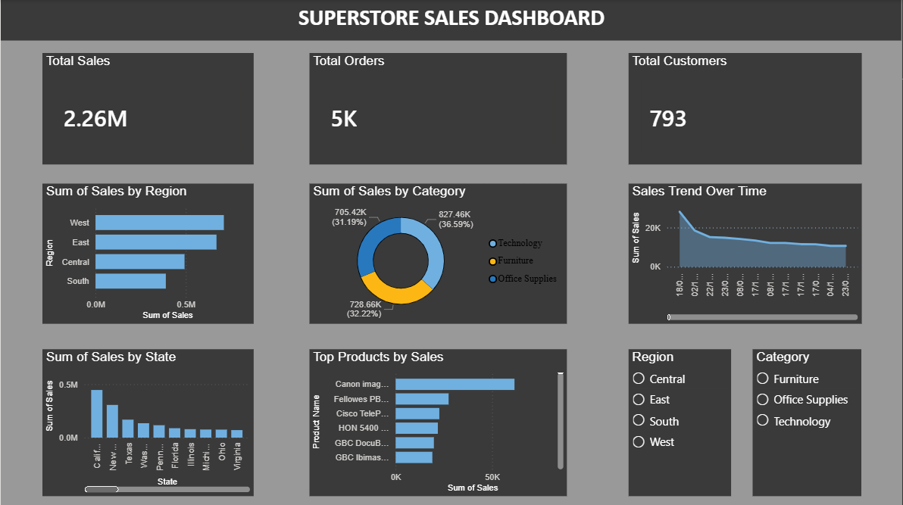

# 📊 Superstore Sales Dashboard using Power BI

## 📌 Project Overview

This project presents an interactive **Superstore Sales Dashboard** developed using **Power BI**. The dashboard is designed to analyze sales performance, customer behavior, product performance, and regional sales distribution through interactive visualizations and KPI metrics.

The objective of this project is to transform raw sales data into meaningful business insights that can support data-driven decision-making.

---

## 🎯 Project Objectives

- Analyze overall sales performance.
- Track total orders and customer count.
- Identify top-performing regions and product categories.
- Monitor sales trends over time.
- Discover top-selling products.
- Enable interactive filtering for detailed analysis.

---

## 🗂 Dataset Information

The dataset contains sales transaction data with the following attributes:

- Row ID
- Order ID
- Order Date
- Ship Date
- Ship Mode
- Customer ID
- Customer Name
- Segment
- Country
- City
- State
- Postal Code
- Region
- Product ID
- Category
- Sub-Category
- Product Name
- Sales

---

## 🛠 Tools & Technologies Used

- Power BI Desktop
- Power Query Editor
- DAX (Data Analysis Expressions)
- Data Visualization
- Data Cleaning & Transformation

---

## 📈 Dashboard Features

### 1️⃣ KPI Cards

The dashboard displays key business metrics:

- **Total Sales:** 2.26M+
- **Total Orders:** 5K+
- **Total Customers:** 793

---

### 2️⃣ Sales by Region

This visualization compares sales performance across different regions:

- West
- East
- Central
- South

It helps identify high-performing and low-performing regions.

---

### 3️⃣ Sales by Category

A donut chart is used to visualize sales contribution by product category:

- Technology
- Furniture
- Office Supplies

This helps understand category-wise revenue distribution.

---

### 4️⃣ Sales Trend Over Time

A line chart displays sales performance across different time periods, helping identify trends and business growth patterns.

---

### 5️⃣ Sales by State

This chart provides state-wise sales comparison and highlights top-performing states.

---

### 6️⃣ Top Products by Sales

This visualization identifies products generating the highest revenue and helps understand product performance.

---

### 7️⃣ Interactive Filters (Slicers)

The dashboard includes interactive slicers:

- Region Filter
- Category Filter

Users can dynamically filter the dashboard and analyze specific business segments.

---

## 📊 DAX Measures Used

### Total Orders

```DAX
Total Orders = DISTINCTCOUNT(train[Order ID])
```

### Total Customers

```DAX
Total Customers = DISTINCTCOUNT(train[Customer ID])
```

---

## 🔍 Data Preparation Process

The following steps were performed before building the dashboard:

1. Imported dataset into Power BI Desktop.
2. Cleaned and transformed data using Power Query.
3. Verified data types for all columns.
4. Removed inconsistencies and validated fields.
5. Created DAX measures for KPI calculations.
6. Built interactive visualizations.
7. Added slicers for filtering and exploration.
8. Applied dashboard themes and formatting.

---

## 📌 Key Business Insights

### ✅ Regional Performance

- West region contributes the highest sales.
- South region contributes comparatively lower sales.

### ✅ Category Performance

- Technology category generates the highest revenue.
- Furniture and Office Supplies also contribute significantly.

### ✅ Product Performance

- A small number of products contribute a major share of overall sales.
- Top-selling products can be targeted for promotional strategies.

### ✅ Customer Analysis

- The business serves 793 unique customers.
- More than 5,000 orders have been processed.

### ✅ Sales Trends

- Sales trend analysis helps monitor performance over time.
- Useful for forecasting and strategic planning.

---

## 📷 Dashboard Preview

### Main Dashboard



---

## 💼 Skills Demonstrated

Through this project, the following skills were applied:

- Data Cleaning
- Data Transformation
- Data Visualization
- Dashboard Design
- Business Intelligence
- KPI Development
- DAX Calculations
- Power BI Reporting
- Data Analysis
- Interactive Reporting

---

## 🚀 Future Improvements

Potential enhancements for future versions:

- Profit Analysis Dashboard
- Customer Segmentation Analysis
- Sales Forecasting
- Profit Margin Tracking
- Drill-through Reports
- Advanced DAX Calculations

---

## 👩‍💻 Author

**Riya Ramteke**

Bachelor of Engineering (Computer Science)

Power BI | Data Analytics | Business Intelligence

---

## ⭐ Project Summary

This Power BI dashboard transforms raw Superstore sales data into meaningful business insights through interactive visualizations, KPI tracking, regional analysis, category analysis, product analysis, and sales trend monitoring. The dashboard enables users to explore business performance efficiently and supports informed decision-making.
